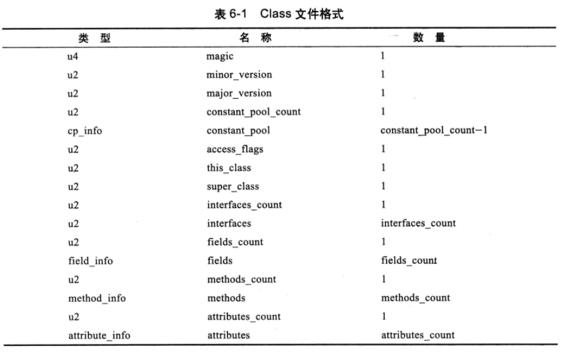
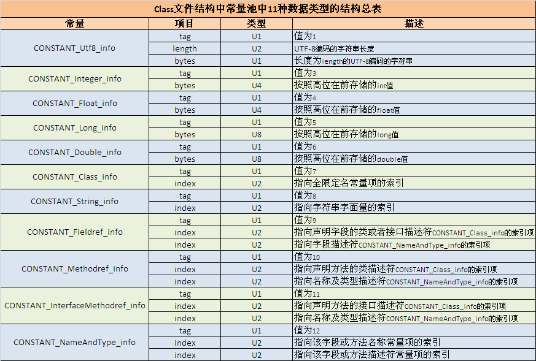
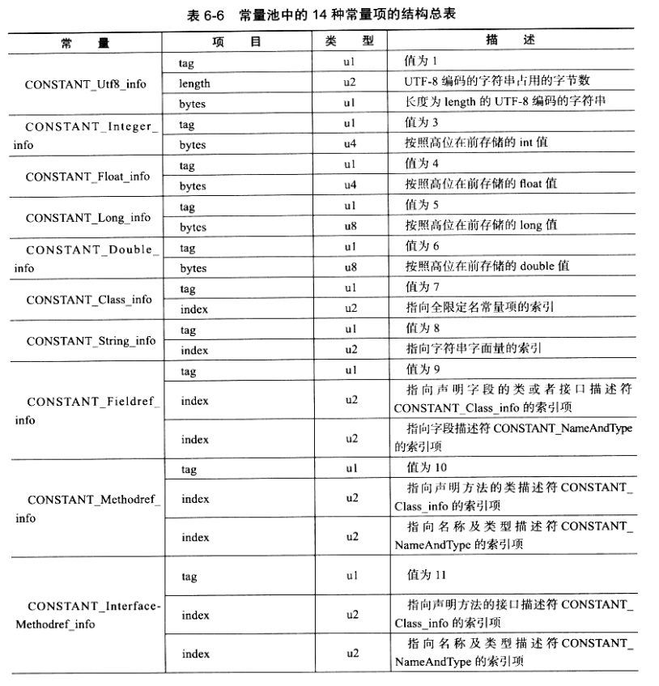
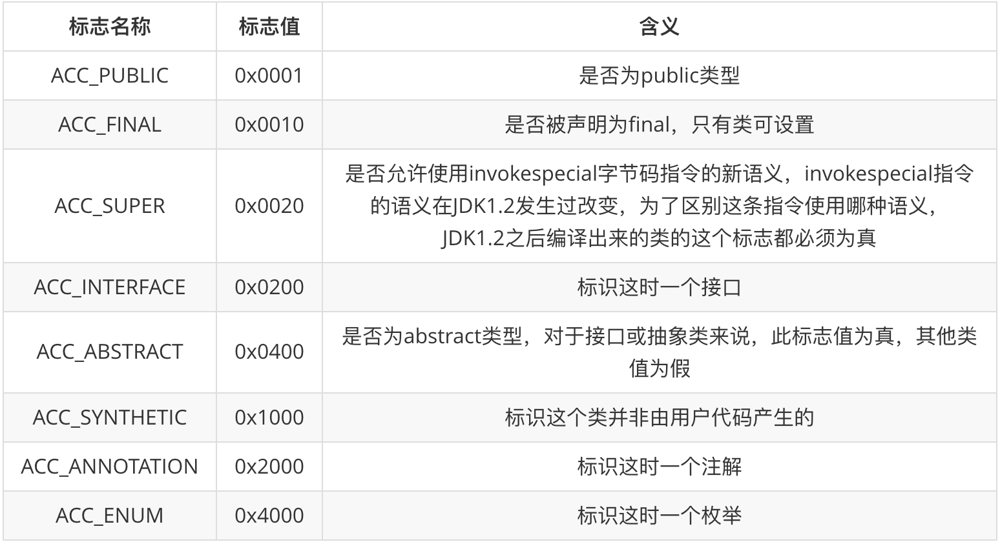
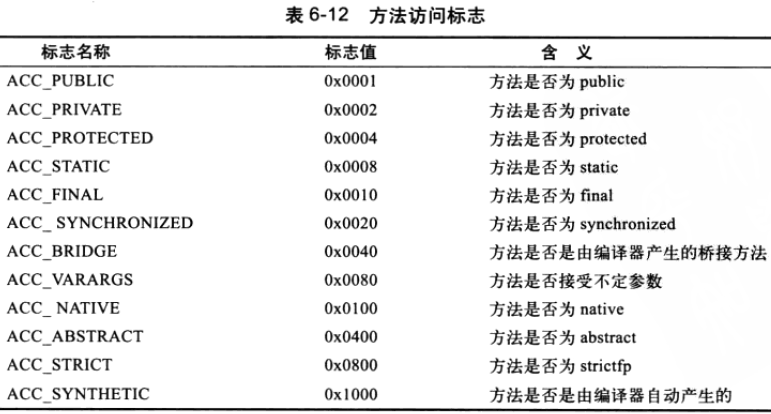
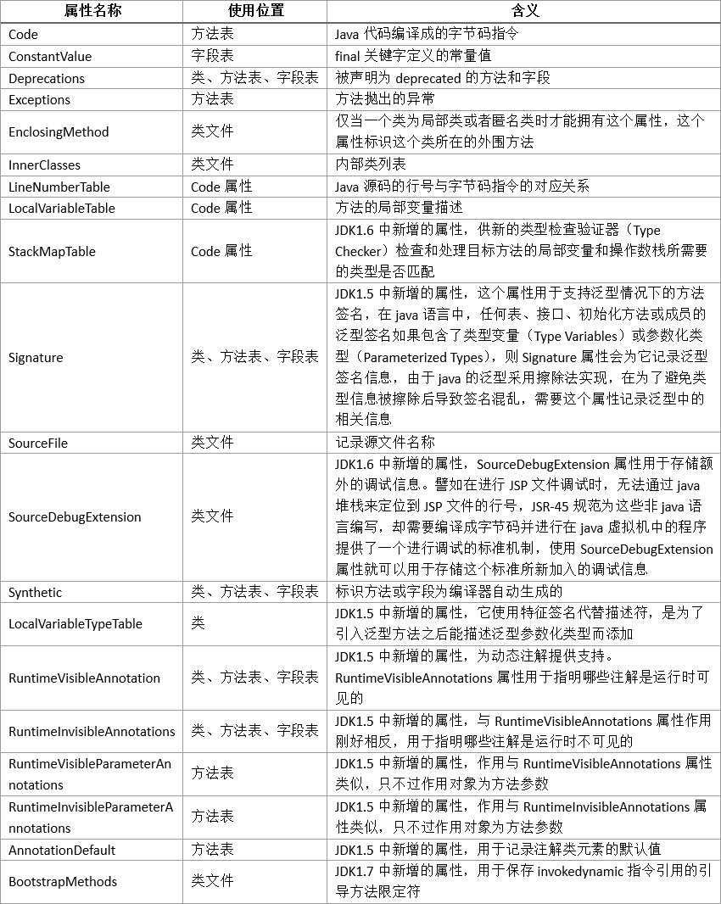

# 类文件结构

##### Class 类文件结构



Class 文件是一组以 8 为字节为基础单位的二进制流，两种数据类型：无符号数和表

无符号数属于基本数据类型，以 u1, u2, u4, u8 来分别代表 1 byte,2byte,4byte,8byte 无符号数

表是由多个无符号数或者其他表作为数据项构成的复合数据类型，所有表习惯性以 "\_info" 结尾

**1. 魔数与 Class 文件版本**

头 4 个字节：魔数（Magic Number）:0xCAFEBABE

第 5 和第 6 个字节是此版本号（Monitor Version），第 7 ，8 个字节是主版本号（Major Version），Java 的版本号是从 45 开始的。JDK 1.7 - Major Version 51.0。

 **2.常量池** Class文件之中的资源仓库

 常量池数量不定，常量池入口需要一项 u2 类型的数据，代表常量池容量计数值（constant_pool_count）

 常量池主要存放两大类常量：

 * 字面量（Literal）,如文本字符串、声明为 final 的常来值等
 * 和符号引用（Symbolic Reference),属于编译原理方面的概念，包括三类常量：
  * 类和接口的全限定名（Fully Qualified Name）
  * 字段的名称和描述符（Descriptor）
  * 方法的名称和描述符


  常量池的项目类型（不全）
  

tag 是标志位...length 值说明这个 utf-8 的字符串长度是多少字节，length 最大值，即 u2 类型能代表的最大值 65536.所以 Java 程序中如果定义了超过 64KB 英文字符的变量或方法名，将无法编译。

下面通过查看类文件 HelloWorld 的文件结构来说明（28 个常量）：


```
public class HelloWorld {

  public static void main(String[] args) {
    System.out.println("Hello World!");
  }
}

```

字节码工具： javap，使用 Javap 输出 HelloWorld.java 的常量表

```
e.g.
$ javac ./example/HelloWorld.java
$ javap -verbose ./example/HelloWorld
警告: 二进制文件HelloWorld包含example.HelloWorld
Classfile /Users/fujw/lynpoRepo/Lyndroid/note/jvm-related/jvm-execute-system/example/HelloWorld.class
  Last modified 2018-5-6; size 434 bytes
  MD5 checksum 33b90127eb71f9ce398156f719f9cc0b
  Compiled from "HelloWorld.java"
public class example.HelloWorld
  minor version: 0
  major version: 52
  flags: ACC_PUBLIC, ACC_SUPER
Constant pool:
   #1 = Methodref          #6.#15         // java/lang/Object."<init>":()V
   #2 = Fieldref           #16.#17        // java/lang/System.out:Ljava/io/PrintStream;
   #3 = String             #18            // Hello World!
   #4 = Methodref          #19.#20        // java/io/PrintStream.println:(Ljava/lang/String;)V
   #5 = Class              #21            // example/HelloWorld
   #6 = Class              #22            // java/lang/Object
   #7 = Utf8               <init>
   #8 = Utf8               ()V
   #9 = Utf8               Code
  #10 = Utf8               LineNumberTable
  #11 = Utf8               main
  #12 = Utf8               ([Ljava/lang/String;)V
  #13 = Utf8               SourceFile
  #14 = Utf8               HelloWorld.java
  #15 = NameAndType        #7:#8          // "<init>":()V
  #16 = Class              #23            // java/lang/System
  #17 = NameAndType        #24:#25        // out:Ljava/io/PrintStream;
  #18 = Utf8               Hello World!
  #19 = Class              #26            // java/io/PrintStream
  #20 = NameAndType        #27:#28        // println:(Ljava/lang/String;)V
  #21 = Utf8               example/HelloWorld
  #22 = Utf8               java/lang/Object
  #23 = Utf8               java/lang/System
  #24 = Utf8               out
  #25 = Utf8               Ljava/io/PrintStream;
  #26 = Utf8               java/io/PrintStream
  #27 = Utf8               println
  #28 = Utf8               (Ljava/lang/String;)V
{
  public example.HelloWorld();
    descriptor: ()V
    flags: ACC_PUBLIC
    Code:
      stack=1, locals=1, args_size=1
         0: aload_0
         1: invokespecial #1                  // Method java/lang/Object."<init>":()V
         4: return
      LineNumberTable:
        line 3: 0

  public static void main(java.lang.String[]);
    descriptor: ([Ljava/lang/String;)V
    flags: ACC_PUBLIC, ACC_STATIC
    Code:
      stack=2, locals=1, args_size=1
         0: getstatic     #2                  // Field java/lang/System.out:Ljava/io/PrintStream;
         3: ldc           #3                  // String Hello World!
         5: invokevirtual #4                  // Method java/io/PrintStream.println:(Ljava/lang/String;)V
         8: return
      LineNumberTable:
        line 6: 0
        line 7: 8
}
SourceFile: "HelloWorld.java"

```

常量池中的 14 中常量项结构总表



 **3. 访问标志**

```
flags: ACC_PUBLIC, ACC_SUPER

```



 **4. 类索引、父类索引与接口索引集合**

 类索引（this_class),父类索引（super_class)

 **5. 字段表集合**

 字段表（field_info)

 **6. 方发表集合**

 依次包括：访问标志（access_flags)，名称索引（name_index)，描述符索引（descriptor_index)， 属性表集合（attributes）

 

 **7. 属性表集合**

 属性表（attribute_info)

 虚拟机规范预定义属性（不全）

 

 以上代码清单中，对应下面段落

 ```
 {
  public example.HelloWorld();
    descriptor: ()V
    flags: ACC_PUBLIC
    Code:
      stack=1, locals=1, args_size=1
         0: aload_0
         1: invokespecial #1                  // Method java/lang/Object."<init>":()V
         4: return
      LineNumberTable:
        line 3: 0

  public static void main(java.lang.String[]);
    descriptor: ([Ljava/lang/String;)V
    flags: ACC_PUBLIC, ACC_STATIC
    Code:
      stack=2, locals=1, args_size=1
         0: getstatic     #2                  // Field java/lang/System.out:Ljava/io/PrintStream;
         3: ldc           #3                  // String Hello World!
         5: invokevirtual #4                  // Method java/io/PrintStream.println:(Ljava/lang/String;)V
         8: return
      LineNumberTable:
        line 6: 0
        line 7: 8
}

 ```

##### 字节码指令

[字节码指令简介](http://www.voidcn.com/article/p-hfdqcqoh-beo.html)

##### Classfile 文件结构发展变化

在变化。。。。。。

E.O.F
