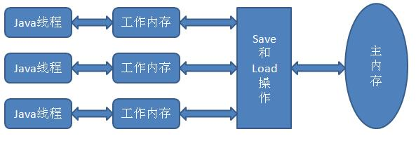
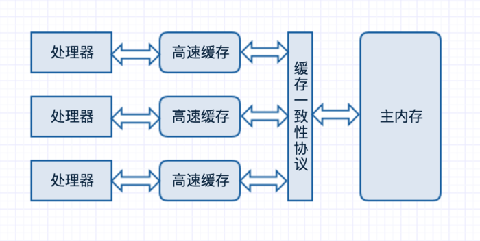
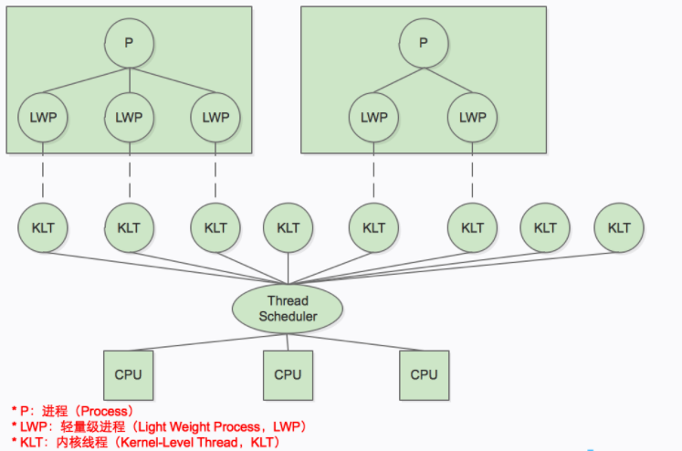
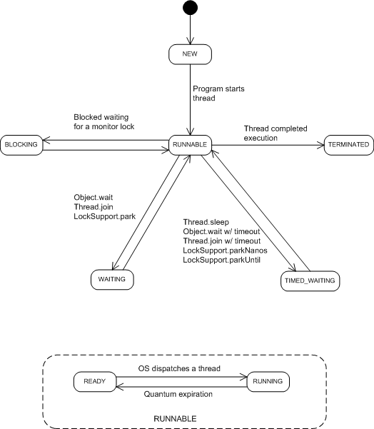

# Java 内存模型与线程

### Java 内存模型（Java Memery Model， JMM）

目标：定义程序变量访问规则（此处变量与 Java 编程中所说的变量区别：此处包括实例字段、静态字段和构成数组对象的元素，
但不包括局部变量与方法参数，后者是线程私有的，不会被共享。

局部变量：如果局部变量是一个 reference 类型，他引用的对象在 Java 堆中可被各个线程共享，但 reference 本身在 Java 栈的局部变量表中，他是线程私有的。

对象拷贝副本：拷贝对象的引用、对象中某个线程访问到的字段存在拷贝（不是整个对象拷贝）。

##### 主内存与工作内存


线程、主内存、工作内存三折的交互关系

类比下图

处理器、高速缓存、主内存间的交互关系

##### 内存间交互操作

 8 种操作：原子的、不可在分的

* lock（锁定）：作用于主内存的变量，把一个变量标识为一条线程独占的状态
* unlock（解锁）：作用于主内存变量，把一个处于锁定状态的变量释放出来，释放后变量才可以被其他线程锁定。
* read（读取）：作用于主内存变量，吧一个变量从主内存传输到线程的工作内存中，一边随后 load 动作使用
* load（载入）：作用于工作内存变量，把 read 操作从主内存中得到的变量值放入工作内存的变量副本中。
* use（使用）：作用于工作内存变量，把工作内存中一个变量的值传递给执行引擎
* assign（赋值）：作用于工作内存变量，把一个从执行引擎接收到的值付给工作内存的变量
*  store（存储）：作用于工作内存变量，把工作内存中一个变量的值传动到主内存中，一边随后的 write 操作使用
* write（写入）：作用于主内存变量，把 store 操作从工作内存中得到的变量值放入主内存变量中。

 read-->load: should be executed in order(not mecessoryly continuously)

 store-->write should be executed in order(not mecessoryly continuously)

 （e.g.: read a, read b, load b, load a)

 其他规则：（部分略）

 * 不允许 read-load, store-write 操作之一单独出现：读了比载入，存储必写入
 * 工作内存中 assign 的变量必须同步回主内存
 * 不允许无原因地（没有 assgin 操作）把数据从工作内存同步回主内存中
 * 新变量只能在主内存中“诞生”，不允许工作内存中直接使用一个未被初始化（load或assign）的变量
 * 一个变量在同一个时刻只允许一条线程对其进行 lock 操作，但 lock 操作可以被同一条线成执行多次，多次执行 lock 后，只有执行相同次数的 unlock 操作，变量才会被解锁。
 * 如果对变量执行 lock 操作，那将会清空工作内存中次变量的值，在执行引擎使用这个变量前，需要重新执行 load 和 assign 操作初始化变量的值。
 * 如果一个变量事先没有被 lock 操作锁定，那就不允许对他执行 unlock 操作，也不允许去 unlock 一个被其他线程锁定的变量。
 * 对一个变量执行 unlock 操作之前，必须先把次变量同步会主内存中（执行 store、write操作）。

##### 对于 volatile 型变量的特殊规则

当一个变量定义为 volatile 之后：

 * 保证此变量对所有线程可见性
  * 可见性：当一条线程修改了这个变量的值，新值对于其他线程来说可以立即得知
 * 禁止指令重排序优化

##### 对于 long 和 double 型变量的特殊规则
上述 8 种操作是原子性的，但是对于 64 位的数据类型（long 和 double），模型中定义了一条相对宽松的规则：

 * 允许虚拟机将没有被 volatile 修饰的 64 位数据的读写操作划分为两次 32 位的操作来进行，即允许虚拟机实现选择可以不保证 64 位数据类型的 load、 store、read 和 write 这 4 个操作的原子性 —— 所谓的 long 和 double 的非原子协定。

 如果有多个线程共享一个未声明为 volatile 的 long 或 double 类型的变量，并同时对他们进行读取和修改操作，可能读取到一个既非原值，也不是其他线程修改值的代表了“半个变量”的数值 —— 这种情况非常罕见（商用 Java 虚拟机不会出现）

##### 原子性、可见性、有序性

 * 原子性： 8 种操作，synchronize 块之间的操作具备原子性
 * 可见性：一个线程修改，其他线程立即得知修改。

 除了 volatile 外，synchronize 和 final 也能实现可见性。

 synchronize 同步快的可见性实现：”对一个变量执行 unlock 之前，必须先把此变量同步回主内存中（执行 store、write 操作）”

 final 的可见性实现：被 final 修饰的字段在构造器中一旦初始化完成，并且构造器没有吧 “this” 的引用传递出去(this 引用逃逸是一件很危险的事情，其他线程有可能通过这个引用访问到“初始化了一半”的对象)，那在其他线程中就能看见 final 字段的值。

 * 有序性：如果在本线程内观察，所有操作都是有序的；如果在一个线程观察另一个线程，所有操作都是无序的。

##### 现行发生原则

 * 程序次序规则：代码（顺序）控制流
 * 管程锁定规则： unlock 先于后面对同一个锁的 lock 操作
 * volatile 变量规则：一个变量的写操作先行发生于读操作
 * 线程启动规则：线程 start() 方法先于线程动作
 * 线程终止规则：线程操作先行与对该线程的终止检测（Thread.join()/Thread.isAlive() 可检测线程已经终止）
 * 线程中断规则：interrupt() 方法调用先行于被中断线程的代码检测到中断事件的发生（Thread.interrupted() 方法检测是否有中断发生）
 * 对象终结规则：对象初始化完成（构造方法执行结束）先行于它的 finalize() 方法的开始。
 * 传递性：操作 A 先行于操作 B， 操作 B 先行于操作 C，则操作 A 先行于操作 C

### Java 与线程

##### 线程的实现

 * 比进程更轻量级的调度单位，共享进程资源（内存地址、文件 I/O 等），也可以独立调度（线程是 CPU 调度的基本单位）
 * Thread 的大部分 API 使用 native 实现（没有使用或无法使用平台无关手段来实现）


 抛开 Java 来说，线程 3 中实现方式：内核线程实现、用户线程实现、用户线程加轻量级进程混合实现

 1. 使用内核线程实现

    * 多线程内核（Multi-Threads Kernal）

    * 使用内核线程的一种高级接口——轻量级进程（Light Weight Process, LWP)

    

    轻量级进程与内核线程之间 1：1 的关系

 2. 使用用户线程实现

 3. 混合

##### Java 线程的实现

 虚拟机规范中并未限定 Java 线程需要使用哪种线程模型来实现。

* Java 线程调度

  * 协同式线程调度：自控

  * 抢占式线程调度：线程执行时间系统控制 √

Java, Thread.yield() 可以让出执行时间，抢占式

线程优先级不太靠谱：Java 线程是通过映射到系统原生线程来实现。


##### Java 线程状态

 * 新建 New， 创建未启动
 * 运行 Runable： Running 和 Ready，正在执行或等待 CPU 分配时间
 * 无限期等待 Waiting：不会被分配 CPU 执行时间，等待被其他线呈唤醒，以下方法让线程进入无限期等待：
  * 没有设置 Timeout 参数的 Object.wait()
  * 没有设置 Timeout 参数的 Thread.join()
  * LockSuppurt.park()
 * 限期等待 Timed Waiting：不会被 CPU 分配执行时间，无需等待其他线程显式地唤醒，在一定时间后系统自动唤醒。以下方法让线程进入限期等待：
  * Thread.sleep()
  * 设置 Timeout 参数的 Object.wait()
  * 设置 Timeout 参数的 Thread.join()
  * LockSuppurt.parkNanos()
  * LockSuppurt.parkUnit()
 * 阻塞 Blocked：等待着获取到一个排它锁，这个事件将在另一个线程放弃这个锁时发生（等待状态是等待一段时间，或者唤醒动作发生）
 * 结束 Terminated：已终止线程状态，执行结束。



线程状态转换关系

##### Java 线程安全

 多线程访问共享资源

 共享操作“安全程度”强弱排序：
  * 不可变：immutable final 变量，String 变量
  * 绝对线程安全：部分 Java API（如 java.util.Vector 容器等）
  * 相对线程安全：Java 大部分线程安全类（Vector, HashTable, Collections 的 synchronizedCollection() 方法包装的集合等）
  * 线程兼容：对象本身非线程安全，调用方使用同步手段
  * 线程对立：无论调用端是否采用同步措施，都无法在多线程环境中并发使用代码。如 Thread 类的 suspend() 和 resume() 方法，如果有两个线程同时持有一个线程对象，一个试图中断线程，另一个试图恢复线程，如果并发进行，无论调用时是否同步，目标线程都存在死锁风险，如果 suspend() 中断的线程就是即将要执行 resume() 的那个线程，肯定产生死锁。因此， JDK 已经声明废弃 （@Deprecated）了 suspend() 和 resume() 方法。常见线程对立操作还有 System.setIn(), System.setOut(), System.runFinalizers() 等。

##### 线程安全实现方法

 1. 互斥同步（阻塞同步，**悲观** 并发策略）
  * synchronized 关键字
  * java.util.concurrent 包中的重入锁（ReentrantLock）

      ```
      try{
        lock.lock();
        // do stuff.
      } finally{
        lock.unlock();
      }
      ```

    BlockingQueue 使用了 ReentrantLock 实现阻塞。

    ReentrantLock 高级功能：
      * 等待可中断：当持有锁的线程长期不释放锁时，正在等待的线程可以选择放弃等待，改为处理其他事情
      * 可实现公平锁：多个线程等待，按照申请锁时间顺序依次获得锁（ReentrantLock 默认是非公平锁，synchronized 中的锁是非公平锁）
      * 锁可以绑定多个条件： ReentrantLock 对象可以绑定多个 Condition 对象

    多线程环境下 synchronizedCollection 吞吐量下降严重， ReentrantLock 能保持稳定水平。

 2. 非阻塞同步（Non-Blocking Synchronization, 基于冲突检测的 **乐观** 并发策略，需要硬件指令集支持）

  常用处理器指令：
    * 测试并设置
    * 获取并增加
    * 交换
    * 比较并交换
    * 加载连接/ 条件存储

 3. 无同步方案

  * 可重入代码
  * 线程本地存储：java 每个 Thread 对象都有一个 java.lang.ThreadLocal 类实现线程本地存储功能； 每个 Thread 对象都有一个 ThreadLocalMap 对象，存储了一组 ThreadLocal.threadLocalHashCode 为键，以本地线程变量为值的 K-V 值对， ThreadLocal 对象就是当前线程的 ThreadLocalMap 的访问入口

##### 锁优化

 HotSpot 虚拟机团队优化：适应性自旋（Adaptive Spining）、锁消除（Lock Elimination）、锁粗化（Lock Coarsening）、轻量级锁（Lightweight Locking）、偏向锁（Biased Locking）等

 锁消除举例：

 ```
 public String concatString(String a, String b, String c) {
   return a + b + c;
 }

 ```

 JDK 1.5 之后版本，此段代码会转化为：

 ```
 public String concatString(String a, String b, String c) {
   StringBuilder sb = new StringBuilder();
   sb.append(a);
   sb.append(b);
   sb.append(c);
   return sb.toString();
 }

 ```

由于 sb 变量动态作用域被限制在 concatString() 方法内部。不会“逃逸”到外部，其他线程无法访问，因此这里有锁，可以被安全地消除掉，在即时编译后，这段代码会忽略掉所有同步直接执行。


E.O.F
